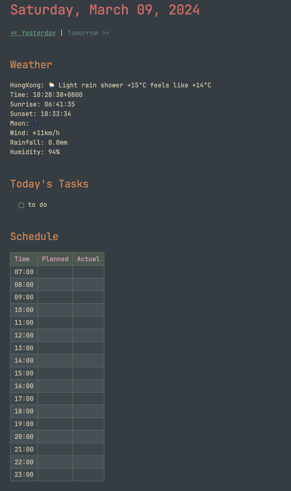

# Obsidian Templates

A collection of templates and scripts for [Obsidian.md](https://obsidian.md/).

## Features

- Prompts to enter a title before a file is created (`people-template.md` and `meeting-template.md`)
- Predefined frontmatter
- *Yesterday* and *Tomorrow* links in `daily-template.md` that create the target file if it doesn't exist
- Embeds current weather in `daily-template.md` using `wttr.in`

## Prerequisites

- [Templater](https://github.com/SilentVoid13/Templater)
- [Periodic Notes](https://github.com/liamcain/obsidian-periodic-notes)
- (Optional) [Tracker](https://github.com/pyrochlore/obsidian-tracker)
- (Optional) [Advanced Tables](https://github.com/tgrosinger/advanced-tables-obsidian)
- (Optional) [Obsidian Map View](https://github.com/esm7/obsidian-map-view)
- (Optional) [Calendar](https://github.com/liamcain/obsidian-calendar-plugin)

## Templates

- [daily-template.md](./templates/daily-template.md)
  - Template for daily note-taking

- [meeting-template.md](./templates/meeting-template.md)
  - Template for meeting minutes
- [person-template.md](./templates/person-template.md)
  - Template for people

## Usage

1. Put the templates in a dedicated folder in your vault
2. Configure *Templater* to read this folder.
3. In *Templater* settings, enable folder templates and add folders that you want a specific template to be triggered.
4. Open `daily-template.md` and replace `<your-target-city>` with your target city, e.g. Paris.

## Tips

- Create dashboards and track your habits

## Notes

Templates are inspired from other people's templates with added functionality to satisfy my use cases.